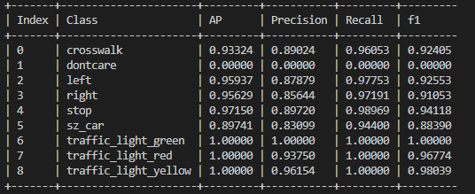
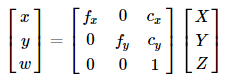
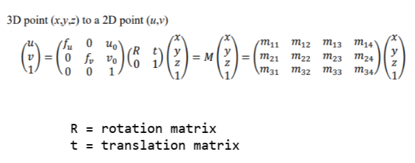

## Team Introduction

- 김민지
- 안원석
- 임지연

## StopLine

- 카메라에서 영상을 수신하여 blur 처리
- BGR 색공간의 이미지를 HSV로 변환
- HSV에서 S채널 분리 후 threshold값에 따라 BINARY 이미지로 변환
- BINARY 이미지를 crop하여 ROI영역을 생성
- 생성된 ROI에서 검은 픽셀값(정지선)이 일정 픽셀값에 도달하면 정지

## Object Detection

- 객체 인식을 위한 적용 모델
    
    YOLOv3 tiny 모델 사용
    
    자이카에서 사용하기 위해 TensorRT로 변환
    
    **yolov3.weights -> yolo.onnx -> yolov3.trt**
    

- 데이터 증강(Data Augmentation) 적용 방법
    
    Rotation -15~15 사이로 회전
    
    Brightness -30~30 사이로 밝기 조절
    
- 객체 인식을 위한 추가적인 알고리즘 소개
    - 이미지 마스킹
        
        사용하지 않거나 학습에 방해되는 부분을 이미지에서 회색으로 마스킹한 뒤 학습
        
    - Anchor Box Optimization
        
        
        
        
        
        6개의 anchor box point 
        
    
- 모델 학습을 위한 하이퍼파라미터 설정 및 선정 이유
    
     Batch size : Batchnormalization 성능을 위해 batch 수 128로 설정
    
    Learning rate : global min을 넘어가지 않게 하기 위해 0.001로 설정
    
    Optimizer : 일반화 성능을 위해 AdamW 사용
    
- 학습 과정 및 결과
    
    

## Distance Estimation

- Camera/LiDAR Calibration 방법
    - Camera Calibration
        
        카메라/렌즈 3차원 공간상의 점들을 2차원 이미지 평면에 투사하기 위해 내부 파라미터(Internal parameters) 추청
        
        
        
        체커보드를 사용하여 fx, fy, cx, cy 변수 추청
        
    - LiDAR Calibration
        
        카메라, 라이다에서 각각 모델을 만든 후 하나의 모델로 퓨전
        
        라이다와 카메라를 퓨전하려면 우선 센서를 calibration하는 작업이 필요
        
        카메라와 라이다의 좌표계를 맞춰주기 위해 이미지의 좌표와 라이다 좌표를 비교하여extrinsic 파라미터 추정
        
        
        
    
- Calibration Result
    
    
- 객체의 위치(거리) 추정 방법
    
    라이다와 카메라 calibration 후 센서퓨전을 통하여 거리 추정
